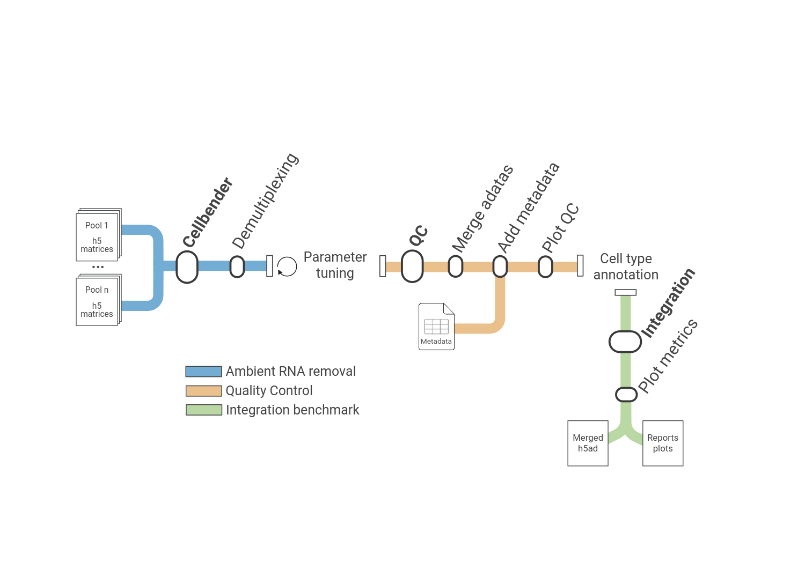

Nextflow pipeline for the preprocessing of multiplexed scRNA-seq data. The pipeline is designed to take as input the matrix generated from the Cellranger alignment step containing the pooled samples. It is structured into three different modules to perform ambient RNA removal, quality control and an integration benchmark.

  

Demultiplexing step is performed by extracting the barcodes called by the aligner from the cellbender output matrix.